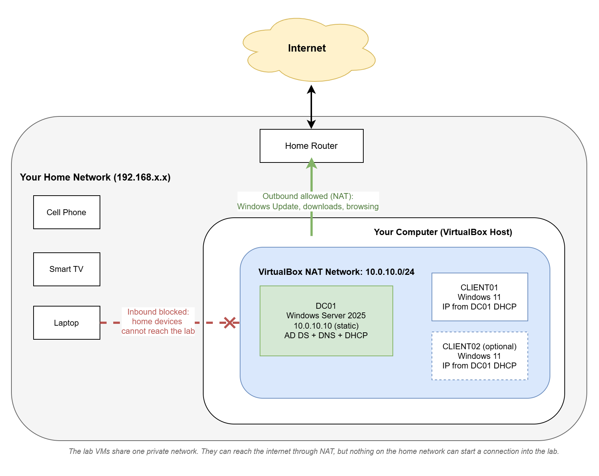

In this module you install VirtualBox and build the private network your lab VMs will use. At the end, the foundation is ready for building the domain controller in Module 3.

## In This Module

- Install VirtualBox
- Create a NAT Network for the lab (10.0.10.0/24)
- Disable VirtualBox's built-in DHCP so your Domain Controller can provide it instead
- Understand why the lab uses its own isolated network

## Install VirtualBox

1. Run the installer you downloaded in Module 1.
2. Accept the defaults on every screen. You do not need to change anything.
3. If the installer warns that your network connection will be temporarily disconnected, click Yes. This is normal. VirtualBox installs virtual network drivers, and the interruption lasts a few seconds.
4. On Windows, the installer may ask to install Microsoft Visual C++ Redistributable first. If so, install it, then run the VirtualBox installer again.
5. Finish the install and launch VirtualBox. You should see the main VirtualBox Manager window with an empty list of virtual machines.

:::note
VirtualBox also includes something called Guest Additions, a set of drivers installed inside each VM that enable screen resizing, a smoother mouse, and clipboard sharing between the VM and your computer. You cannot install them yet because they go inside a running VM. This guide covers installing them right after each Windows install, in Modules 3 and 6.
:::

## How the Lab Network Works

The lab runs on its own private network inside your computer. The VMs can talk to each other and reach the internet for updates and downloads, but the lab's DHCP, DNS, and Active Directory traffic never touches your home network, and your home devices cannot connect into the lab.

That isolation is one-way, though. Lab VMs can still make outbound connections to the internet and to your home network, so the lab is contained, not sealed. It is safe for everything this guide teaches, but it is not a sandbox for malware samples or penetration testing tools like Kali Linux. That kind of work requires a fully isolated network with no internet access and is beyond the scope of this guide.

## Create the Lab Network

VirtualBox calls this type of network a NAT Network. You create it once, and every lab VM will attach to it.

1. In VirtualBox Manager, open the menu **File > Tools > Network Manager**.
2. Click the **NAT Networks** tab.
3. Click **Create**. A new network appears in the list.
4. Select it and set these properties:
   - **Name:** `ADLab`
   - **IPv4 Prefix:** `10.0.10.0/24`
   - **Enable DHCP:** unchecked
5. Click **Apply**, then close Network Manager.

That is the entire network setup. You will attach each VM to the ADLab network when you create it.

### Why Disable DHCP?

DHCP is the service that hands out IP addresses to devices on a network. VirtualBox has its own built-in DHCP server, but in a real Windows environment that job belongs to a Windows server. In Module 5 you will install DHCP on your domain controller, exactly like a real business network. If VirtualBox's DHCP stayed on, the two servers would compete to answer requests and cause confusing problems.

Until Module 5, the lab network simply has no DHCP. That is fine, because the domain controller uses a manually assigned address anyway.

## Checklist Before Moving On

- [ ] VirtualBox installed and the Manager window opens
- [ ] NAT Network named ADLab exists with prefix 10.0.10.0/24
- [ ] DHCP is unchecked on the ADLab network

Continue to Module 3 to create the domain controller VM and install Windows Server 2025.
